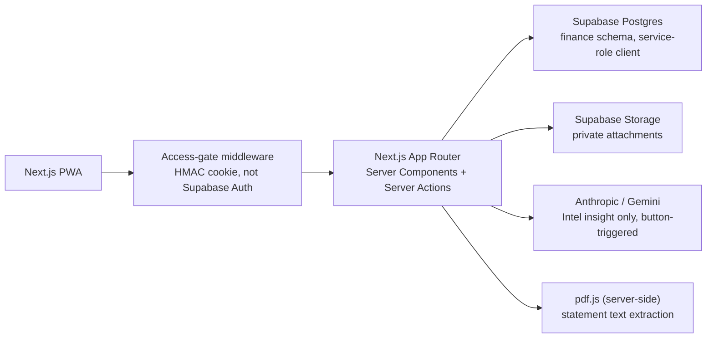

# System Architecture

> See [00 — Current state](./00-current-state.md) first, especially the
> auth model section — it corrects the diagram below, which originally
> assumed live Supabase Auth sessions and RLS as the enforcement boundary.

## Actual architecture

The application is a Next.js backend-for-frontend (BFF) over Supabase
Postgres and Storage. There is no per-request Supabase Auth session: an
HMAC-signed access-gate cookie stands in for sign-in, and every server-side
read/write goes through a single service-role client
(`src/lib/supabase/service.ts`) scoped to one fixed owner account
(`OWNER_USER_ID`, from `src/lib/owner.ts`). The browser never talks to
Supabase directly.



## Boundaries

| Layer | Responsibility | Must not do |
| --- | --- | --- |
| `src/app` | Routing, layouts, pages. Thin — no business logic. | Contain domain rules or SQL construction. |
| `src/features/<feature>` | UI, feature schemas, and `api/actions.ts` server actions. | Reach into another feature's internals. |
| `src/services` | Server-side orchestration: one class per domain area, always filtering by `OWNER_USER_ID`. | Render UI. |
| `src/services/statement-parsers/<issuer>` | Deterministic PDF-statement-to-structured-data parsing for one issuer. | Decide merchant identity or category — that's the Merchant Dictionary's job. |
| `src/lib` | Cross-cutting infrastructure: Supabase clients, money, dates, env validation, PDF extraction, owner constant, access gate. | Become a miscellaneous dumping ground. |
| `finance` schema | Durable structure and invariants (constraints, FKs, RLS policies kept for future-multi-user correctness). | Assume RLS is the live enforcement path — it currently isn't (see doc 00). |

## Actual repository structure

```text
src/
  app/
    (app)/<route>/page.tsx     # dashboard, transactions, accounts, budgets,
                                # imports, net-worth, settings, intel, merchants,
                                # calendar, recurring, onboarding, more
    api/attachments/           # the one route-handler surface (signed upload/download)
    login/                     # access-gate login page
  components/ui/                # shadcn primitives
  features/<feature>/
    api/actions.ts               # server actions — the real mutation surface
    components/
  services/                     # AccountService, TransactionService, BudgetSnapshotService,
                                 # CreditCardStatementService, MerchantDictionaryService,
                                 # MerchantService, StatementImportService, IntelService,
                                 # CreditCardIntelService, ReportingService, NetWorthService,
                                 # CalendarEventService, TripService, RecurringTransactionService,
                                 # CategoryService, InstitutionService, AssetService,
                                 # LiabilityService, UserSettingsService, AttachmentService
  services/statement-parsers/
    hdfc-infinia-tata/           # types, amounts, parse-header, parse-transactions,
    axis-horizon-airtel/         #   classify-transaction, normalize-merchant, reconcile, index
  lib/
    money/                       # Money branded type + decimal.js-backed arithmetic
    dates/                       # calendar grid, recurrence, phase, month helpers
    pdf/                         # extract-text.ts (pdf.js), dommatrix polyfill, worker setup
    intel/                       # card-category-breakdown, donut chart data prep
    budget/                      # home-stats, planned card dues
    accounts/                    # spendable-balance math
    env/                         # server/public env validation (Zod)
    owner.ts                     # OWNER_USER_ID constant
    access-gate.ts                # HMAC cookie gate
    supabase/service.ts           # the one Supabase client every service uses
  hooks/
  types/
supabase/
  migrations/                    # append-only, heavily commented with rationale
docs/                            # this folder
INSTALL.md                       # actual setup/deploy source of truth (repo root)
```

Every feature owns its UI and server actions; cross-feature workflows live
in a service, not a route component.

## Runtime choices

- Server Components for dashboard and report reads.
- Client Components for interactive forms, upload flows, and chart
  controls.
- Server Actions (`features/*/api/actions.ts`) for authenticated mutations
  — the actual pattern used everywhere except attachments, which use a
  route handler (`src/app/api/attachments/`) for signed URL issuance.
- No worker/queue infrastructure exists yet. Statement parsing runs
  synchronously within the request that handles the upload — acceptable
  today because a statement PDF is small and parsing is fast and
  deterministic (no LLM call in the parse path).

## Core domain services (as actually built)

- `AccountService`, `CategoryService`, `InstitutionService`,
  `UserSettingsService`: ledger foundations.
- `TransactionService`: validates, writes, and summarizes transactions.
- `RecurringTransactionService`: recurring templates and generation.
- `BudgetSnapshotService`: planned vs. actual, including planned card dues
  folded in from statement imports.
- `AssetService`, `LiabilityService`, `NetWorthService`: net-worth
  aggregation.
- `AttachmentService`: signed upload/download URLs and metadata.
- `StatementImportService`: orchestrates PDF decryption (per-issuer
  password from env), extraction, and dispatch to the right parser.
- `CreditCardStatementService`: per-issuer save pipeline — parse, reconcile,
  hash for dedupe, insert statement + transactions, resolve merchants,
  roll back on partial failure.
- `MerchantDictionaryService`: exact/normalized alias resolution against
  `finance.merchants` / `finance.merchant_aliases` / `finance.atlas_categories`,
  shared across every issuer's parser.
- `MerchantService`: the `/merchants` admin screen's read/edit surface.
- `ReportingService`, `CreditCardIntelService`, `IntelService`: dashboard
  aggregates, card-level category breakdowns, and the button-triggered AI
  insight (`finance.intel_insights`).
- `CalendarEventService`, `TripService`: the Calendar tab's user-entered
  data (school calendar itself is static in-code data, not a table).
