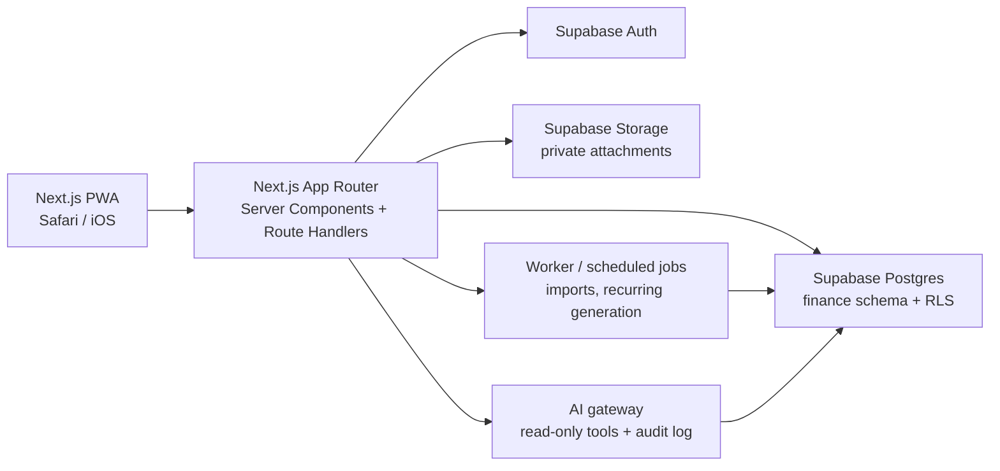

# System Architecture

## Target architecture

The application is a Next.js backend-for-frontend (BFF) backed by Supabase Postgres, Auth, and Storage. The browser uses the authenticated Supabase client only for narrowly scoped reads or realtime needs. Commands that enforce business rules, import data, invoke AI, or access the service-role key execute on the server.



## Boundaries

| Layer | Responsibility | Must not do |
| --- | --- | --- |
| `src/app` | Routing, layouts, route handlers, server actions. | Contain domain rules or SQL construction. |
| `src/features/<feature>` | UI, feature schemas, queries, and feature-specific components. | Reach into another feature's internals. |
| `src/services` | Server-side orchestration of imports, reporting, AI, and integrations. | Render UI. |
| `src/lib` | Cross-cutting infrastructure: Supabase, dates, money, auth helpers. | Become a miscellaneous dumping ground. |
| `finance` schema | Persistent integrity, tenancy enforcement, and storage metadata. | Depend on frontend behavior for data safety. |

## Target repository structure

```text
src/
  app/                    # route groups, layouts, pages, route handlers
  components/
    ui/                   # shadcn primitives only
    shared/               # cross-feature presentation components
  features/
    accounts/
    assistant/
    attachments/
    budgets/
    dashboard/
    imports/
    investments/
    reports/
    transactions/
  hooks/                  # genuinely cross-feature React hooks
  lib/
    auth/                 # server/client session helpers
    db/                   # generated types and query infrastructure
    money/                # decimal, currency, and formatting helpers
    validation/           # common Zod utilities
  services/               # server-only business workflows
  types/                  # stable shared DTOs, not database row duplicates
  test/                   # fixtures, factories, and test helpers
supabase/
  migrations/             # append-only database changes
  seed.sql                # local development seed data, never production data
docs/                     # architecture and operational documentation
```

Every feature owns its UI, validation, and feature-local data access. Cross-feature business flows live in a server-only service, not a route component or shared utility.

## Runtime choices

- Use Server Components for dashboard and report reads where possible.
- Use Client Components only for interactive forms, chart controls, upload flows, and optimistic pending UI.
- Use Route Handlers for external-style HTTP endpoints and webhook receivers. Use server actions for co-located authenticated mutations when their request/response contract is not public.
- Use a worker or scheduled function for recurring-transaction generation, statement processing, and expensive report snapshots. Never make an HTTP request wait for a large import.

## Core domain services

- `TransactionService`: validates, writes, edits, voids, and summarizes transactions.
- `BudgetService`: manages periods, lines, planned amounts, and actuals.
- `ImportService`: stages files, parses, deduplicates, matches, and commits reviewed rows.
- `AttachmentService`: creates signed upload/download URLs and writes attachment metadata.
- `ReportingService`: produces server-side aggregates for dashboard, cash flow, budget, and net-worth views.
- `AssistantService`: turns approved user questions into bounded tool calls and auditable responses.

## Current-state implications

The present client and server Supabase helpers are useful primitives, but they do not yet provide request middleware, generated database types, error normalization, or authorization helpers. Add those before feature development starts.
