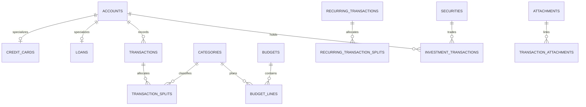

# Database Design

## Schema ownership

All application data belongs in the `finance` schema in the existing Vitals Supabase project. `auth` and `storage` remain Supabase-managed schemas. The public schema must not become a second home for finance data.

## Existing model

The migrations establish:

- `user_settings`, `institutions`, and `accounts` as account ownership and currency foundations.
- `credit_cards` and `loans` as one-to-one account specializations.
- Hierarchical `categories`, `budgets`, and `budget_lines`.
- `transactions` plus `transaction_splits` for income, expenses, transfers, and category allocation.
- `recurring_transactions` and their category splits.
- `assets`, `liabilities`, `securities`, and `investment_transactions` for net-worth and future investment capability.
- `attachments` with explicit link tables rather than a polymorphic foreign key.

## Data invariants

- All money uses `numeric(18,2)`; securities quantities and unit prices use `numeric(24,8)`.
- `currency_code` is uppercase ISO-4217 text. Do not store currency symbols as data.
- Amounts are positive; `transaction.kind` provides the semantic direction. Transfers require a distinct destination account.
- Account, category, template, attachment, and other references must have the same `user_id`; the integrity-guard migration enforces this.
- Credit-card, loan, asset, liability, and investment detail records require the corresponding account type.
- Posted records are historical facts. Prefer `void` or correcting transactions over destructive edits once a record is reconciled.

## Required schema additions before each feature

1. Add migration tests in a disposable Supabase database.
2. Add database TypeScript types with `supabase gen types typescript --schema finance`.
3. Add ownership triggers and RLS policies for every new table.
4. Add supporting indexes from the query plan, not guesswork.
5. Record a rollback or forward-fix procedure in the pull request.

## Reporting strategy

Start with parameterized aggregates over indexed tables. For common period queries, aggregate from `transactions` joined with `transaction_splits`; exclude `void` records. Introduce materialized views or daily snapshots only when explain-analyze evidence shows they are necessary. Any cached summary must record its range, timezone, account scope, and refresh time.

## Migration policy

Migrations are append-only once applied to Vitals. Never rewrite an applied timestamped migration. Add a corrective migration instead. Before production application, back up, run on staging, inspect the generated schema diff, and apply through the Supabase CLI in CI.

## Supabase access

`service_role` has schema, table, sequence, and function grants. It bypasses RLS and is restricted to server jobs and route handlers. Add `finance` to the Vitals API exposed schemas before a client calls `supabase.schema('finance')`. The browser must never receive a service-role key.
