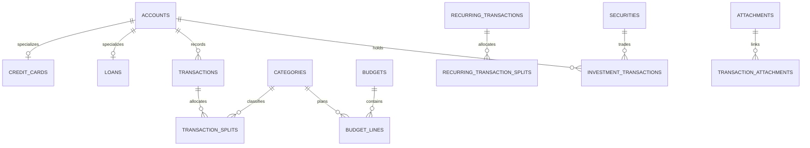

# Database Design

> See [00 — Current state](./00-current-state.md) for the auth model.
> RLS policies below are real and correctly written, but are **not the
> live enforcement mechanism** — every service filters explicitly by
> `OWNER_USER_ID` instead. Keep writing RLS policies and ownership
> triggers on new tables anyway; they document the intended boundary and
> would matter again if this app ever became genuinely multi-user.

## Schema ownership

All application data lives in the `finance` schema in the Supabase
project. `auth` and `storage` remain Supabase-managed. The public schema is
not a second home for finance data.

## Ledger core (original design, still accurate)

`user_settings`, `institutions`, `accounts` (with `credit_cards`/`loans` as
1:1 specializations), hierarchical `categories`, `budgets`/`budget_lines`,
`transactions`/`transaction_splits`, `recurring_transactions` and their
splits, `assets`/`liabilities`, `securities`/`investment_transactions`
(schema exists, no investment UI built yet), and `attachments` with
explicit link tables (`transaction_attachments`, `account_attachments`,
etc.) rather than a polymorphic FK. See
`supabase/migrations/20260710000100_create_finance_schema.sql` for the
exact DDL and its comments.

## Credit-card statement imports (added v1.3.0–v1.4.0)

`finance.credit_card_statements` — one row per successfully **parsed and
reconciled** statement PDF. Deliberately a read-only mirror of what the
statement itself says, separate from `finance.transactions` (the ledger).
Deduplication key: `(user_id, statement_hash, statement_date, card_last4)`,
where `statement_hash` is a sha256 of the *extracted text* (not the raw PDF
bytes) so re-encoded copies of the same statement still collide correctly.

`finance.credit_card_transactions` — one row per parsed transaction line,
FK'd to a statement. `amount` is always the printed magnitude;
`transaction_type` (`debit`/`credit`) carries direction. `merchant_raw` /
`merchant_normalized` are null for non-merchant rows (payments, fees,
bank charges — see `isBankFeeOrTax` in each parser's
`classify-transaction.ts`). `purchase_indicator_code`/`purchase_indicator_name`
are both nullable: HDFC prints a colour-coded icon (unparseable as text),
Axis Horizon prints an actual "MERCHANT CATEGORY" column
(`purchase_indicator_name`).

Both tables added `cycle_month` (a `date` truncated to the 1st, meaning
"the calendar month this statement's charges are due/attributed to" —
statement month + 1, see `cycleMonthForStatementDate` in
`src/lib/statement-cycle.ts`) via
`20260714000100_add_transaction_cycle_month.sql` and
`20260723000100_add_cycle_month_to_credit_card_statements.sql`, used to
group Intel's card-level breakdown and budget-dues folding by billing
cycle rather than calendar/statement month.

See `supabase/migrations/20260721000100_create_credit_card_statements.sql`
for the full DDL and its rationale comments.

## Merchant Dictionary (added v1.5.0)

Shared across every issuer's parser — a parser's only job is "this raw
text appeared on the statement," never "what merchant/category this is."

- `finance.atlas_categories` — the master category/subcategory taxonomy,
  self-referencing via `parent_category_id` (matching `finance.categories`'
  existing pattern), seeded once via `scripts/seed-atlas-categories.mjs`.
- `finance.merchants` — one row per real-world merchant, with
  `atlas_category_id`/`atlas_subcategory_id` as the **only** source of a
  transaction's category (never copied onto a transaction row —
  always resolved through the join).
- `finance.merchant_aliases` — every raw/normalized text variant that
  resolves to a merchant, `unique (user_id, alias)`, deterministic 1:1
  lookup (`MerchantDictionaryService.resolveMerchantsForImport`).
- `finance.credit_card_transactions` gained a `merchant_id` FK
  (`20260722000200_add_merchant_to_credit_card_transactions.sql`) resolved
  at import time, sequentially per statement.

See `supabase/migrations/20260722000100_create_merchant_dictionary.sql`.

## Intel insight (added v1.6.1)

`finance.intel_insights` — one row per user (in practice, one row total),
the most recently generated AI insight text and its timestamp. Written
only when the user presses "Generate commentary" (`IntelService.regenerateInsight`),
never on page load — see doc 07.

## Calendar / travel (added v1.0–v1.1)

`finance.trips` — user-entered booked travel (destination, date range,
flight, `traveler_names` as a denormalized `text[]`, not a travellers
table — there's no reasonable multi-attribute traveller entity here).
`finance.calendar_events` (plus a later migration adding `people` to it) —
general calendar entries. The static school calendar itself is **in-code
data**, not a table (`src/features/calendar/data.ts`) — there's no
reasonable write path for someone else's school calendar.

## Data invariants (unchanged)

- All money uses `numeric(18,2)`; securities use `numeric(24,8)`.
- `currency_code`/`statement_currency`/`currency` are uppercase ISO-4217
  text, never symbols.
- Amounts are positive; direction comes from `kind`/`transaction_type`.
- Cross-table references require matching `user_id` — enforced by the
  `assert_reference_owner` trigger pattern
  (`20260710000300_add_finance_integrity_guards.sql`), applied to every
  new FK added since (credit card transactions → statements, merchants →
  categories, aliases → merchants).
- In application code, money is never a raw number — see the `Money`
  branded type in `src/lib/money` and doc 08.

## Migration policy (unchanged)

Migrations are append-only once applied. Never rewrite an applied
timestamped migration — add a corrective one. Every migration in this repo
carries a substantial comment block explaining the "why," not just the
DDL — keep that convention for new ones.
