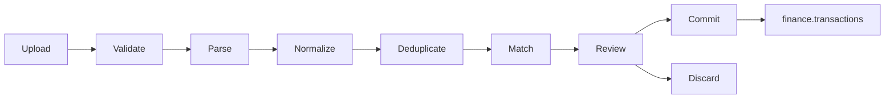

# Import Engine Specification

## Goal

Turn bank, card, and cash-statement files into reviewable transaction candidates without silently changing the ledger. The import engine is a staged workflow, not a direct CSV-to-transaction insert.

## Supported formats and canonical row

Phase one supports CSV with a per-institution mapping profile. Add OFX/QFX next. Normalize every source row into:

```text
source_transaction_id, occurred_on, posted_on, description,
amount, currency_code, balance, direction, raw_payload_hash
```

Store the original file privately and retain a parsed, immutable staging record. Never alter raw import evidence after parsing.

## Workflow



1. Create an import job with idempotency key, account, source name, file checksum, and user.
2. Upload to a private staging path using a signed URL.
3. Parse asynchronously; record parser version, detected encoding, headers, and row-level errors.
4. Normalize dates, decimal separators, signs, currencies, and descriptions.
5. Deduplicate against the same file checksum, source ID, and a configurable fingerprint of account/date/amount/description.
6. Suggest category, transfer, and recurring matches with a confidence score and explanation.
7. Show an explicit review queue. Auto-commit only if a future policy permits it and every confidence/risk rule passes.
8. Commit in an atomic, idempotent operation; retain a link from created transaction to import row.

## Required future tables

Add `import_jobs`, `import_files`, `import_rows`, `import_mappings`, `import_matches`, and `import_commit_log` in a dedicated migration before implementation. Keep source data separate from `transactions`; import provenance must survive ledger edits.

## Matching policy

- Exact source transaction ID match: duplicate, never reimport.
- Same account, amount, date window, normalized description: probable duplicate, requires review unless prior source identity is known.
- Internal account-to-account pattern: transfer candidate, never auto-create both sides without user policy.
- Categorization rules are user-scoped, ordered, auditable, and reversible.

## Failure behavior

Parsing failures affect a row, not unrelated rows. A malformed statement cannot partially commit. The user can download an error report, correct a mapping, and retry with the same source file; idempotency records prevent duplicate ledger writes.
