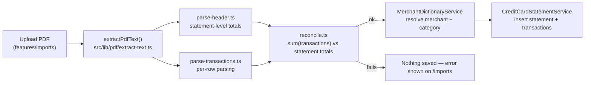

# Import Engine — Credit Card Statement Parsing

> The original target below described a generic CSV/OFX bank-statement
> import engine with a staging/review/commit workflow. **That was never
> built.** What exists instead is a deterministic, no-LLM PDF
> credit-card-statement parser, one module per card issuer, that parses
> and reconciles a statement in a single request and only saves it if the
> numbers add up. This doc describes that system.

## Goal

Turn a credit card statement PDF into structured, reconciled statement +
transaction rows without ever guessing. If the parsed transactions don't
sum to what the statement itself claims, nothing is saved — not even a
partial set of rows.

## Supported issuers

- **HDFC Infinia / Tata Neu Plus**
  (`src/services/statement-parsers/hdfc-infinia-tata/`, added as
  `hdfc-infinia` in v1.3.0, renamed in v1.11.0) — covers two real HDFC
  retail card products against one shared parser: identical transaction
  table shape and totals/limits block on both, differing only in which
  rewards section is printed ("Opening Balance"/HDFC Reward Points for
  Infinia vs. "NeuCoins" for the Tata Neu Plus co-branded card, which also
  has no points-expiry sub-section at all) — `cardType` is read directly
  from whichever section is present, see that module's `types.ts` and
  `parse-header.ts`. Unlike the two generalizations below, this one keeps
  TWO separate `CardStatementSource` entries (`hdfc-infinia` and
  `hdfc-tata-neu`) with their own password env vars, since HDFC's
  co-branded cards aren't guaranteed to share the core product's password
  formula — both still dispatch to the same parser and save function
  (`saveHdfcStatement`), since parsing auto-detects cardType from the
  statement's own content.
- **Axis Horizon / Airtel**
  (`src/services/statement-parsers/axis-horizon-airtel/`, added as
  `axis-horizon` in v1.7.0, renamed in v1.10.0) — covers two real Axis
  retail card products against one shared parser: identical PAYMENT
  SUMMARY / limits / reconciliation-row layout and password scheme on
  both, differing only in which rewards section is printed ("eDGE MILES
  POINTS" for Horizon vs. "CASHBACK DETAILS" for the Airtel co-branded
  Mastercard) — `cardType` is read directly from whichever section is
  present, see that module's `types.ts` and `parse-header.ts`.
- **ICICI Amazon Pay / RuPay**
  (`src/services/statement-parsers/icici-amazon-rupay/`, added as
  `icici-amazon` in v1.8.0, renamed in v1.9.0) — covers two real ICICI
  retail card products against one shared parser: its own summary block
  combines "purchases" and "charges" into one figure rather than
  splitting them like HDFC/Axis do, and neither real statement prints its
  own product name anywhere in the body, so `cardType` ("Amazon Pay" vs.
  "RuPay") is inferred from which rewards section is present (cashback vs.
  points) — see that module's `types.ts` and `parse-header.ts`.

`src/services/statement-parsers/axis-atlas/`, the pre-rename
`src/services/statement-parsers/axis-horizon/`, the pre-rename
`src/services/statement-parsers/icici-amazon/`, and the pre-rename
`src/services/statement-parsers/hdfc-infinia/` are all leftovers from
naming changes (an earlier "Axis Horizon" rename, the v1.10.0
"axis-horizon-airtel" rename, the "icici-amazon-rupay" rename, and the
v1.11.0 "hdfc-infinia-tata" rename, respectively) — all untracked in git
and should be deleted from disk by hand; nothing references any of them.

Adding a new issuer means adding a new directory with the same module
shape (below) plus a new `CardStatementSource` entry in
`src/features/imports/cards.ts` and a new password env var in
`src/lib/env/server.ts` — not a redesign.

## Pipeline



1. **Extract** (`src/lib/pdf/extract-text.ts`): pdf.js legacy Node build,
   password-aware. `reconstructLayout()` turns pdf.js's flat positioned
   text items into row/column-preserving text by grouping items within
   `ROW_TOLERANCE` of the same y-position and inserting whitespace
   proportional to the x-gap between items. This is the single most
   fragile part of the whole pipeline — see the "Known fragility" section
   below.
2. **Parse header** (`parse-header.ts`): anchored, whole-row-shape regexes
   against literal label text extract the statement's own totals (total
   due, minimum due, previous balance, payments received, purchases,
   finance charges, credit limits, reward points, etc.) — never derived
   from summing transactions.
3. **Parse transactions** (`parse-transactions.ts`): per-row regex over
   the reconstructed text, one row per real transaction line. Handles
   multi-cardholder statements (primary vs. add-on, detected via a
   `Card No: ... Name ...` header line reappearing mid-table) and
   description continuation lines.
4. **Classify** (`classify-transaction.ts`): flags payments, cashback,
   refunds, reversals, and bank fee/tax lines (`isBankFeeOrTax`) —
   determines what counts as a genuine merchant purchase vs. a
   fee/charge/payment, both for Merchant Dictionary exclusion and for
   reconciliation bucketing (see below).
5. **Reconcile** (`reconcile.ts`): sums parsed transactions (split into
   "purchases" vs. "finance charges" using the same `isBankFeeOrTax`
   classifier — a real statement can print these as two separate totals;
   see the v1.7.3 fix in Axis Horizon/Airtel's `reconcile.ts` for why lumping
   them together silently breaks reconciliation) and checks each against
   the statement's own printed total, plus a full "total amount due"
   identity check, all with a relative tolerance
   (`max(1.00, 0.05% × statementValue)`). **Any failed check blocks the
   save entirely.**
6. **Resolve merchants** (`MerchantDictionaryService.resolveMerchantsForImport`):
   sequential per-import exact-then-normalized alias lookup against the
   shared Merchant Dictionary, tagged with a `sourceBank` string
   (`"hdfc-infinia-tata"`, `"axis-horizon-airtel"`, `"icici-amazon-rupay"`).
7. **Save** (`CreditCardStatementService`): hash the extracted text for
   dedupe (`statement_hash` + date + card last 4), insert the statement
   row (with `cycle_month`), insert transaction rows, roll back the
   statement row if transaction insert fails partway.

## Per-issuer module shape (fixed convention)

```text
src/services/statement-parsers/<issuer>/
  types.ts                 # AxisStatementHeader/Transaction or HDFC equivalent
  amounts.ts                # findAmount/findDecimalAmount/findInteger token extraction
  parse-header.ts
  parse-transactions.ts
  classify-transaction.ts
  normalize-merchant.ts
  reconcile.ts
  index.ts                  # re-exports everything
  *.test.ts                 # synthetic fixtures ONLY — never real statement data
```

## Known fragility (read before touching a parser)

- **The `\s{2,}` "two-or-more-spaces means a column boundary" heuristic**
  used throughout row-parsing regexes depends entirely on
  `reconstructLayout()`'s `gap / spaceWidth` space-count computation,
  which in turn depends on pdf.js's reported glyph widths —
  environment-sensitive (`useSystemFonts: true` resolves against whatever
  fonts are actually installed on the host, which differs between a dev
  sandbox and a Vercel serverless container). **Never make a required
  match boundary depend on an exact space count** — a real production bug
  (v1.7.2) had every transaction row silently fail to match because a
  required 2+-space boundary rendered as one space in production. Prefer
  `\s+` for anything the row's basic shape depends on, and reserve
  `\s{2,}` only for optional, best-effort column splits that degrade
  gracefully (fold into the adjacent field) rather than drop the row.
- **Validate parser changes against real statement text before trusting
  them**, using a throwaway `__scratch-*.test.ts` that imports the real
  `extractPdfText` (not a hand-rolled mirror script) against real PDF
  bytes, then neuter it back to `describe.skip` before committing — never
  commit real personal data in a fixture.
- **A statement's own summary totals can be split into more buckets than
  you'd assume** (e.g. Axis Horizon/Airtel's "purchases" vs. "finance charges" as
  two separate printed totals) — verify the exact reconciliation identity
  against a real statement's numbers before assuming a simpler formula
  holds.

## Explicitly not built

Bank CSV/OFX import, a staging/review/commit workflow, transfer-candidate
matching, and user-editable import mapping rules — none of this exists.
If a future card issuer's PDF can't be parsed deterministically (e.g. a
scanned image with no text layer), that's a new problem, not covered by
this pipeline.
